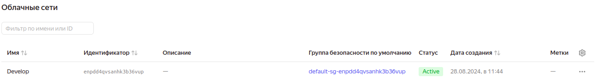
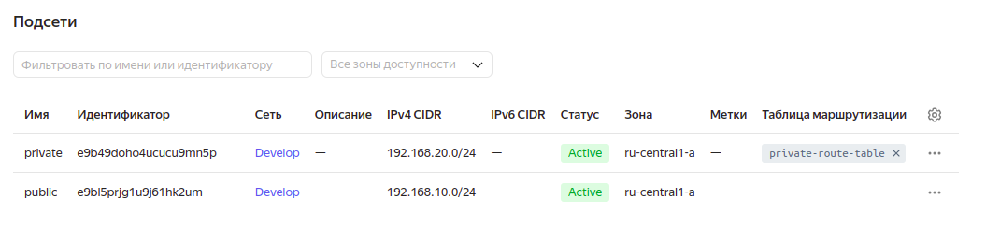
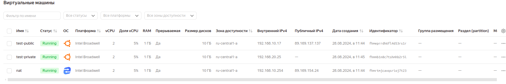
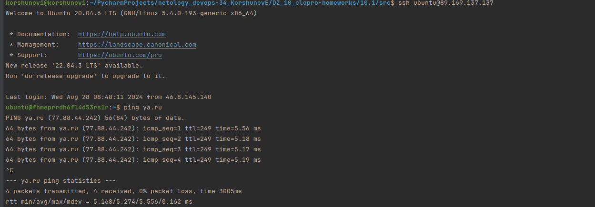
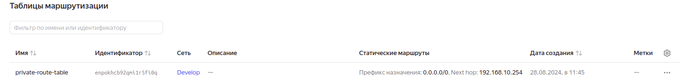
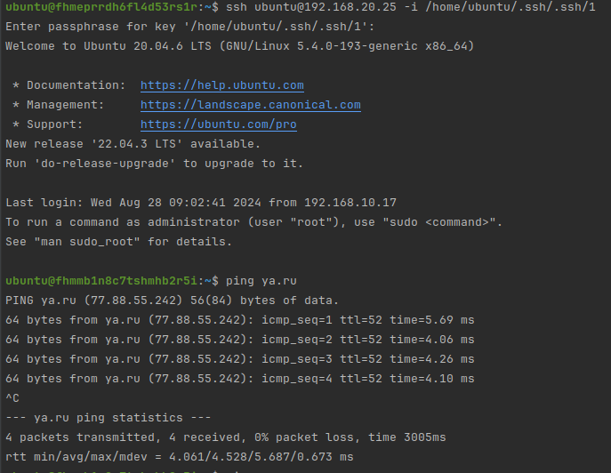
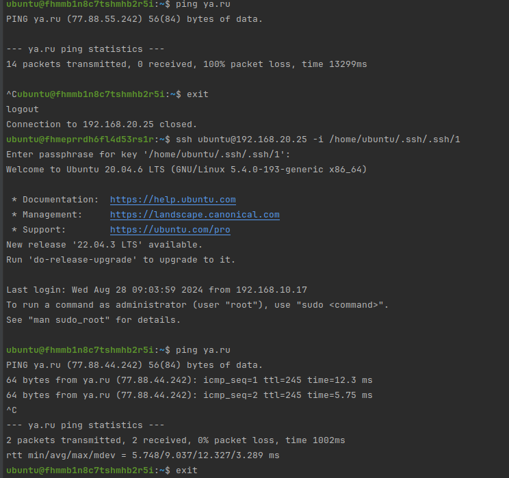
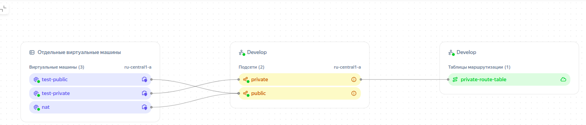

# Домашнее задание
к занятию «Организация сети»

### Подготовка к выполнению задания

1. Домашнее задание состоит из обязательной части, которую нужно выполнить на провайдере Yandex Cloud, и дополнительной части в AWS (выполняется по желанию). 
2. Все домашние задания в блоке 15 связаны друг с другом и в конце представляют пример законченной инфраструктуры.  
3. Все задания нужно выполнить с помощью Terraform. Результатом выполненного домашнего задания будет код в репозитории. 
4. Перед началом работы настройте доступ к облачным ресурсам из Terraform, используя материалы прошлых лекций и домашнее задание по теме «Облачные провайдеры и синтаксис Terraform». Заранее выберите регион (в случае AWS) и зону.

---
### Задание 1. Yandex Cloud 

**Что нужно сделать**

1. Создать пустую VPC. Выбрать зону.



```
resource "yandex_vpc_network" "develop" {
  name = var.vpc_name
}
```

2. Публичная подсеть.

 - Создать в VPC subnet с названием public, сетью 192.168.10.0/24.



[main.tf](src/main.tf)

```commandline
resource "yandex_vpc_subnet" "public" {
  name           = var.subnet_name
  zone           = var.default_zone
  network_id     = yandex_vpc_network.develop.id
  v4_cidr_blocks = var.default_cidr
}
```
 - Создать в этой подсети NAT-инстанс, присвоив ему адрес 192.168.10.254. В качестве image_id использовать fd80mrhj8fl2oe87o4e1.

```commandline
data "yandex_compute_image" "nat" {
  family = "nat-instance-ubuntu"
}

resource "yandex_compute_instance" "platform" {
  name        = var.nat.vm_name
  platform_id = var.nat.platform_id
  resources {
    cores         = var.nat.cpu
    memory        = var.nat.ram
    core_fraction = var.nat.core_fraction
  }

  boot_disk {
    initialize_params {
      image_id = data.yandex_compute_image.nat.image_id
      type = "network-hdd"
      size = var.nat.disk
    }
  }
  scheduling_policy {
    preemptible = true
  }
  network_interface {
    subnet_id = yandex_vpc_subnet.public.id
    nat       = true
    ip_address = "192.168.10.254"
  }

  metadata = {
    serial-port-enable = 1
    ssh-keys       = local.vms_ssh_root_key
  }
}

```

 - Создать в этой публичной подсети виртуалку с публичным IP, подключиться к ней и убедиться, что есть доступ к интернету.





[vm.tf](src/vm.tf)

[variables.tf](src/variables.tf)


3. Приватная подсеть.
 - Создать в VPC subnet с названием private, сетью 192.168.20.0/24.

```commandline
resource "yandex_vpc_subnet" "private" {
  name           = var.subnet_private
  zone           = var.default_zone
  network_id     = yandex_vpc_network.develop.id
  v4_cidr_blocks = var.private_cidr
  route_table_id = yandex_vpc_route_table.private-route-table.id
}
```

 - Создать route table. Добавить статический маршрут, направляющий весь исходящий трафик private сети в NAT-инстанс.

```commandline
resource "yandex_vpc_route_table" "private-route-table" {
  name       = var.route-table
  network_id = yandex_vpc_network.develop.id
  static_route {
    destination_prefix = "0.0.0.0/0"
    next_hop_address = yandex_compute_instance.platform.network_interface.0.ip_address
  }
}
```


[main.tf](src/main.tf)

 - Создать в этой приватной подсети виртуалку с внутренним IP, подключиться к ней через виртуалку, созданную ранее, и убедиться, что есть доступ к интернету.



При отключении nat, трафик идти перестал:


При повторном включении nat, зайдя повторно на виртуалку, трафик доступы во вне открываются:



Общая картина:



```commandline
+----------------------+--------------+---------------+---------+----------------+----------------+
|          ID          |     NAME     |    ZONE ID    | STATUS  |  EXTERNAL IP   |  INTERNAL IP   |
+----------------------+--------------+---------------+---------+----------------+----------------+
| fhmeprrdh6fl4d53rs1r | test-public  | ru-central1-a | RUNNING | 89.169.137.137 | 192.168.10.17  |
| fhmmb1n8c7tshmhb2r5i | test-private | ru-central1-a | RUNNING |                | 192.168.20.25  |
| fhmrtmjcavqsrioj7t23 | nat          | ru-central1-a | RUNNING | 89.169.154.24  | 192.168.10.254 |
+----------------------+--------------+---------------+---------+----------------+----------------+
```

Resource Terraform для Yandex Cloud:

- [VPC subnet](https://registry.terraform.io/providers/yandex-cloud/yandex/latest/docs/resources/vpc_subnet).
- [Route table](https://registry.terraform.io/providers/yandex-cloud/yandex/latest/docs/resources/vpc_route_table).
- [Compute Instance](https://registry.terraform.io/providers/yandex-cloud/yandex/latest/docs/resources/compute_instance).

---
### Задание 2. AWS* (задание со звёздочкой)

Это необязательное задание. Его выполнение не влияет на получение зачёта по домашней работе.

**Что нужно сделать**

1. Создать пустую VPC с подсетью 10.10.0.0/16.
2. Публичная подсеть.

 - Создать в VPC subnet с названием public, сетью 10.10.1.0/24.
 - Разрешить в этой subnet присвоение public IP по-умолчанию.
 - Создать Internet gateway.
 - Добавить в таблицу маршрутизации маршрут, направляющий весь исходящий трафик в Internet gateway.
 - Создать security group с разрешающими правилами на SSH и ICMP. Привязать эту security group на все, создаваемые в этом ДЗ, виртуалки.
 - Создать в этой подсети виртуалку и убедиться, что инстанс имеет публичный IP. Подключиться к ней, убедиться, что есть доступ к интернету.
 - Добавить NAT gateway в public subnet.
3. Приватная подсеть.
 - Создать в VPC subnet с названием private, сетью 10.10.2.0/24.
 - Создать отдельную таблицу маршрутизации и привязать её к private подсети.
 - Добавить Route, направляющий весь исходящий трафик private сети в NAT.
 - Создать виртуалку в приватной сети.
 - Подключиться к ней по SSH по приватному IP через виртуалку, созданную ранее в публичной подсети, и убедиться, что с виртуалки есть выход в интернет.

Resource Terraform:

1. [VPC](https://registry.terraform.io/providers/hashicorp/aws/latest/docs/resources/vpc).
1. [Subnet](https://registry.terraform.io/providers/hashicorp/aws/latest/docs/resources/subnet).
1. [Internet Gateway](https://registry.terraform.io/providers/hashicorp/aws/latest/docs/resources/internet_gateway).

### Правила приёма работы

Домашняя работа оформляется в своём Git репозитории в файле README.md. Выполненное домашнее задание пришлите ссылкой на .md-файл в вашем репозитории.
Файл README.md должен содержать скриншоты вывода необходимых команд, а также скриншоты результатов.
Репозиторий должен содержать тексты манифестов или ссылки на них в файле README.md.
