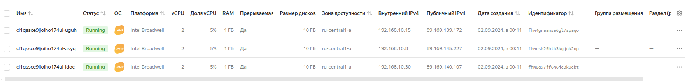
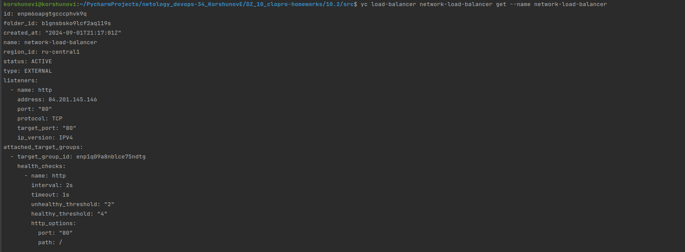
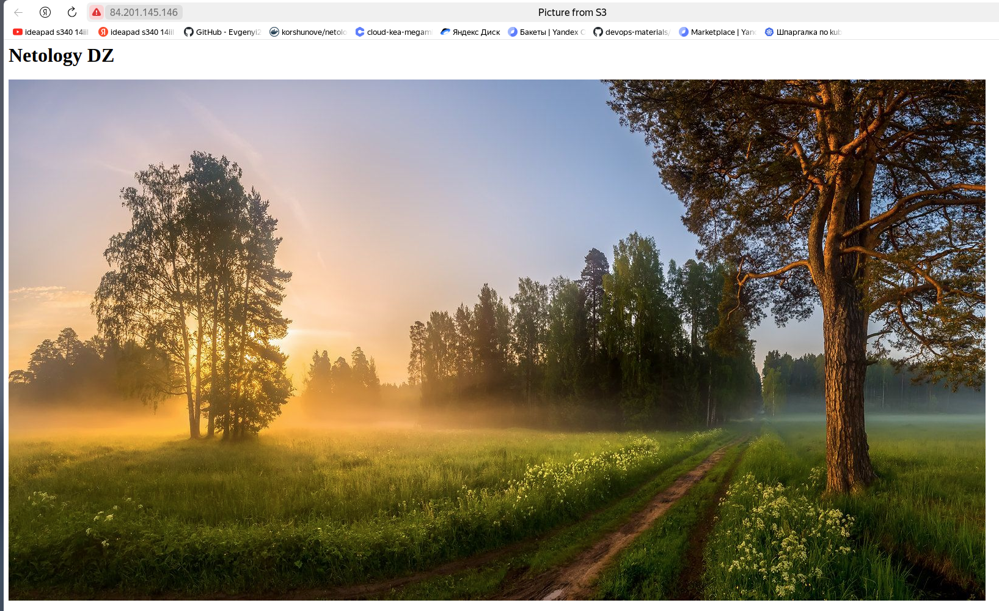
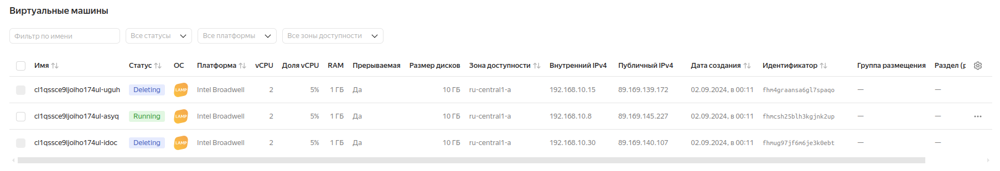
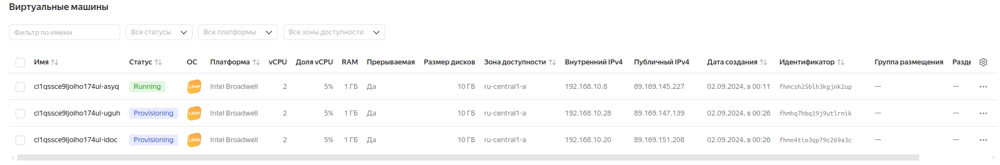
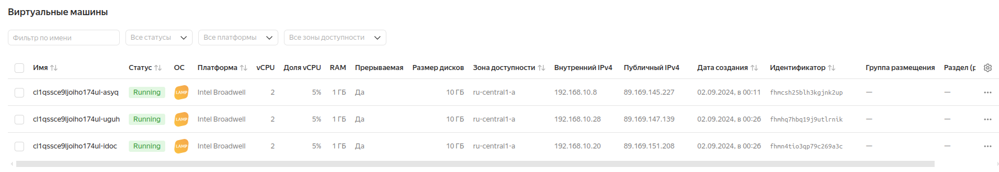
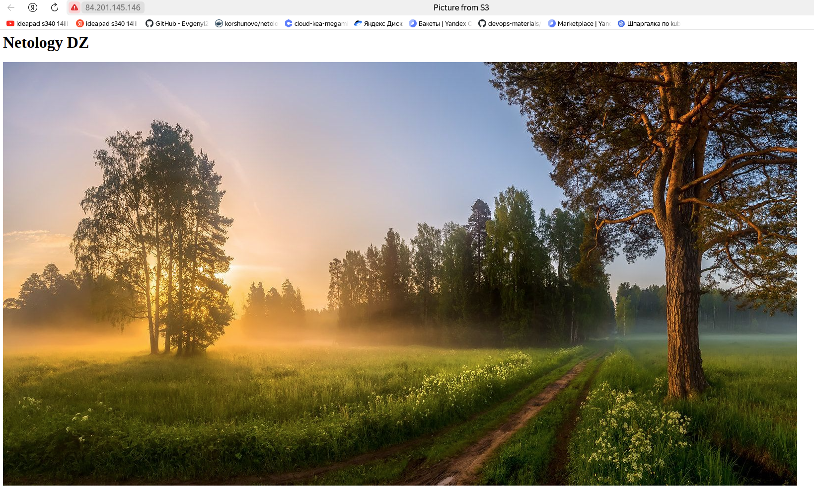
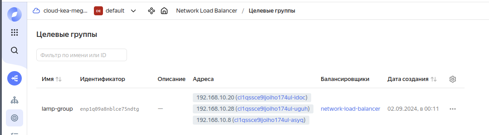

# Домашнее задание к занятию «Вычислительные мощности. Балансировщики нагрузки»  

### Подготовка к выполнению задания

1. Домашнее задание состоит из обязательной части, которую нужно выполнить на провайдере Yandex Cloud, и дополнительной части в AWS (выполняется по желанию). 
2. Все домашние задания в блоке 15 связаны друг с другом и в конце представляют пример законченной инфраструктуры.  
3. Все задания нужно выполнить с помощью Terraform. Результатом выполненного домашнего задания будет код в репозитории. 
4. Перед началом работы настройте доступ к облачным ресурсам из Terraform, используя материалы прошлых лекций и домашних заданий.

---
## Задание 1. Yandex Cloud 

**Что нужно сделать**

1. Создать бакет Object Storage и разместить в нём файл с картинкой:

 - Создать бакет в Object Storage с произвольным именем (например, _имя_студента_дата_).

[bucket.tf](src/bucket.tf)

 - Положить в бакет файл с картинкой.

```commandline
# Положить в бакет файл с картинкой.
resource "yandex_storage_object" "picture" {
  access_key = yandex_iam_service_account_static_access_key.sa-static-key.access_key
  secret_key = yandex_iam_service_account_static_access_key.sa-static-key.secret_key
  bucket = "netology-s3-evgenyi"
  key    = "s3.jpg"
  source = "/home/korshunovi/PycharmProjects/netology_devops-34_KorshunovE/DZ_10_clopro-homeworks/10.2/picture/s3.jpg"
  acl    = "public-read"
  depends_on = [ yandex_storage_bucket.bucket ]
}
```

 - Сделать файл доступным из интернета.


 
2. Создать группу ВМ в public подсети фиксированного размера с шаблоном LAMP и веб-страницей, содержащей ссылку на картинку из бакета:

 - Создать Instance Group с тремя ВМ и шаблоном LAMP. Для LAMP рекомендуется использовать `image_id = fd827b91d99psvq5fjit`.

[main.tf](src/main.tf)

[group_vm.tf](src/group_vm.tf)

[variables.tf](src/variables.tf)

 - Для создания стартовой веб-страницы рекомендуется использовать раздел `user_data` в [meta_data](https://cloud.yandex.ru/docs/compute/concepts/vm-metadata).

```commandline
metadata = {
      serial-port-enable = 1
      ssh-keys           = local.vms_ssh_root_key
      user-data  = <<EOF
#!/bin/bash
cd /var/www/html
echo '<html><head><title>Picture from S3</title></head> <body><h1>Netology DZ</h1></body></html>' > index.html
EOF
    }
```

 - Разместить в стартовой веб-странице шаблонной ВМ ссылку на картинку из бакета.




 - Настроить проверку состояния ВМ.

```commandline
  health_check {
    interval = 60
    timeout  = 20
    tcp_options {
      port = 80
    }
  }
```
 
Health check выполняется с периодичностью 1 минута. Если в течении 20 секунд по 80 порту ВМ доступна, то проверка успешна.

3. Подключить группу к сетевому балансировщику:

 - Создать сетевой балансировщик.

[network_load_balancer.tf](src/network_load_balancer.tf)

 - Проверить работоспособность, удалив одну или несколько ВМ.





После удаления 2-х машин, картинка через балансировщик доступна.







Балансировщик поднял заново удалённые машины, картинка так же доступна.





4. (дополнительно)* Создать Application Load Balancer с использованием Instance group и проверкой состояния.

Полезные документы:

- [Compute instance group](https://registry.terraform.io/providers/yandex-cloud/yandex/latest/docs/resources/compute_instance_group).
- [Network Load Balancer](https://registry.terraform.io/providers/yandex-cloud/yandex/latest/docs/resources/lb_network_load_balancer).
- [Группа ВМ с сетевым балансировщиком](https://cloud.yandex.ru/docs/compute/operations/instance-groups/create-with-balancer).

---
## Задание 2*. AWS (задание со звёздочкой)

Это необязательное задание. Его выполнение не влияет на получение зачёта по домашней работе.

**Что нужно сделать**

Используя конфигурации, выполненные в домашнем задании из предыдущего занятия, добавить к Production like сети Autoscaling group из трёх EC2-инстансов с  автоматической установкой веб-сервера в private домен.

1. Создать бакет S3 и разместить в нём файл с картинкой:

 - Создать бакет в S3 с произвольным именем (например, _имя_студента_дата_).
 - Положить в бакет файл с картинкой.
 - Сделать доступным из интернета.
2. Сделать Launch configurations с использованием bootstrap-скрипта с созданием веб-страницы, на которой будет ссылка на картинку в S3. 
3. Загрузить три ЕС2-инстанса и настроить LB с помощью Autoscaling Group.

Resource Terraform:

- [S3 bucket](https://registry.terraform.io/providers/hashicorp/aws/latest/docs/resources/s3_bucket)
- [Launch Template](https://registry.terraform.io/providers/hashicorp/aws/latest/docs/resources/launch_template).
- [Autoscaling group](https://registry.terraform.io/providers/hashicorp/aws/latest/docs/resources/autoscaling_group).
- [Launch configuration](https://registry.terraform.io/providers/hashicorp/aws/latest/docs/resources/launch_configuration).

Пример bootstrap-скрипта:

```
#!/bin/bash
yum install httpd -y
service httpd start
chkconfig httpd on
cd /var/www/html
echo "<html><h1>My cool web-server</h1></html>" > index.html
```
### Правила приёма работы

Домашняя работа оформляется в своём Git репозитории в файле README.md. Выполненное домашнее задание пришлите ссылкой на .md-файл в вашем репозитории.
Файл README.md должен содержать скриншоты вывода необходимых команд, а также скриншоты результатов.
Репозиторий должен содержать тексты манифестов или ссылки на них в файле README.md.
