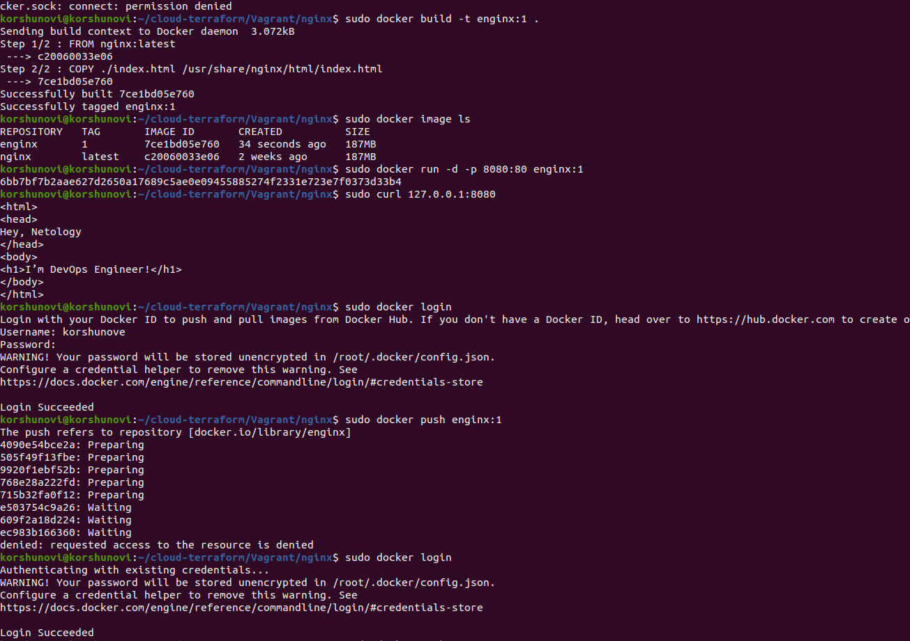

# Домашнее задание к занятию 3. «Введение. Экосистема. Архитектура. Жизненный цикл Docker-контейнера»


## Задача 1

Сценарий выполнения задачи:

- создайте свой репозиторий на https://hub.docker.com;
- выберите любой образ, который содержит веб-сервер Nginx;
- создайте свой fork образа;
- реализуйте функциональность:
запуск веб-сервера в фоне с индекс-страницей, содержащей HTML-код ниже:
```
<html>
<head>
Hey, Netology
</head>
<body>
<h1>I’m DevOps Engineer!</h1>
</body>
</html>
```

Опубликуйте созданный fork в своём репозитории и предоставьте ответ в виде ссылки на https://hub.docker.com/username_repo.

При попытке опубликовать в своём репозитории (https://hub.docker.com/r/korshunove/netology/) всё время получаю ошибку (denied: requested access to the resource is denied), пробовал выполнять задание с разных серверов, пересоздавал репозиторий, результат так и не получил. Скриншоты работы ниже:




## Задача 2

Посмотрите на сценарий ниже и ответьте на вопрос:
«Подходит ли в этом сценарии использование Docker-контейнеров или лучше подойдёт виртуальная машина, физическая машина? Может быть, возможны разные варианты?»

Детально опишите и обоснуйте свой выбор.

--

Сценарий:

- высоконагруженное монолитное Java веб-приложение;
Скорее всего использовал бы виртуальные/физические машины, т.к. ресурсы будут доступны только для данного приложения, + монолитность будет тяжалее эксплуатировать посредствам Docker-контейнеров.

- Nodejs веб-приложение;
Можно будет использовать контейнеризацию, т.к. легко будет разворачиваться/обновляться и при необходимости масштабироваться. 

- мобильное приложение c версиями для Android и iOS;
Наверное возможно совместное использование машин и докер контейнеров, в зависимости от потребности,  для финального развёртывания приложений использовать виртуальные машины, а для тестирования приложения или его частей подойдёт Docker. 

- шина данных на базе Apache Kafka;
Думаю подойдут виртуальные/физические машины, чтобы оптимально использовать ресурсы и при необходимости была возможность увеличить их.

- Elasticsearch-кластер для реализации логирования продуктивного веб-приложения — три ноды elasticsearch, два logstash и две ноды kibana;
В интернете пишут об возможности использования и Docker-а и ВМ. Так как в данной области опыта практически нет, то думаю возможно использовать любой вариант.

- мониторинг-стек на базе Prometheus и Grafana;
Использовал бы Docker контейнеры, легко разварачиваются, быстро масштабируются и должны покрывать потребности.

- MongoDB как основное хранилище данных для Java-приложения;
Использовал бы ВМ или ФМ, для более отказойстоячивой работы и возможности использовать по максимому выделенных ресурсов.

- Gitlab-сервер для реализации CI/CD-процессов и приватный (закрытый) Docker Registry.
Думаю Docker контейнеры, т.к. есть готовые решения, позволяющие оптимизировать работу, укомплектовав всё в контейнеры, легко разворачивается.

## Задача 3

- Запустите первый контейнер из образа ***centos*** c любым тегом в фоновом режиме, подключив папку ```/data``` из текущей рабочей директории на хостовой машине в ```/data``` контейнера.
- Запустите второй контейнер из образа ***debian*** в фоновом режиме, подключив папку ```/data``` из текущей рабочей директории на хостовой машине в ```/data``` контейнера.
- Подключитесь к первому контейнеру с помощью ```docker exec``` и создайте текстовый файл любого содержания в ```/data```.
- Добавьте ещё один файл в папку ```/data``` на хостовой машине.
- Подключитесь во второй контейнер и отобразите листинг и содержание файлов в ```/data``` контейнера.


## Задача 4 (*)

Воспроизведите практическую часть лекции самостоятельно.

Соберите Docker-образ с Ansible, загрузите на Docker Hub и пришлите ссылку вместе с остальными ответами к задачам.

<pre><font color="#4E9A06"><b>korshunovi@korshunovi</b></font>:<font color="#3465A4"><b>/data</b></font>$ sudo docker pull ubuntu
[sudo] пароль для korshunovi: 
Using default tag: latest
latest: Pulling from library/ubuntu
aece8493d397: Pull complete 
Digest: sha256:2b7412e6465c3c7fc5bb21d3e6f1917c167358449fecac8176c6e496e5c1f05f
Status: Downloaded newer image for ubuntu:latest
docker.io/library/ubuntu:latest
<font color="#4E9A06"><b>korshunovi@korshunovi</b></font>:<font color="#3465A4"><b>/data</b></font>$ cd /home/korshunovi/cloud-terraform/Vagrant/nginx
<font color="#4E9A06"><b>korshunovi@korshunovi</b></font>:<font color="#3465A4"><b>~/cloud-terraform/Vagrant/nginx</b></font>$ ll
итого 16
drwxrwxr-x 2 korshunovi korshunovi 4096 ноя 15 16:44 <font color="#3465A4"><b>.</b></font>/
drwxrwxr-x 5 korshunovi korshunovi 4096 ноя 15 20:56 <font color="#3465A4"><b>..</b></font>/
-rw-rw-r-- 1 korshunovi korshunovi   69 ноя 15 16:44 dockerfile
-rw-rw-r-- 1 korshunovi korshunovi   91 ноя 15 16:44 index.html
<font color="#4E9A06"><b>korshunovi@korshunovi</b></font>:<font color="#3465A4"><b>~/cloud-terraform/Vagrant/nginx</b></font>$ vi dockerfile</pre>


<pre><font color="#4E9A06"><b>korshunovi@korshunovi</b></font>:<font color="#3465A4"><b>~/cloud-terraform/Vagrant</b></font>$ sudo docker build -t ubuntu/ansible:1 .
Sending build context to Docker daemon  758.4MB
Step 1/6 : FROM alpine:3.14
 ---&gt; 9e179bacf43c
Step 2/6 : RUN  CARGO_NET_GIT_FETCH_WITH_CLI=1 &amp;&amp;      apk --no-cache add sudo python3 py3-pip openssl ca-certificates sshpass openssh-client rsync git &amp;&amp;      apk --no-cache add      --virtual build-dependencies python3-dev libffi-dev musl-dev gcc cargo openssl-dev         libressl-dev         build-base &amp;&amp;      pip install --upgrade pip wheel &amp;&amp;      pip install --upgrade cryptography cffi &amp;&amp;      pip install ansible==2.10 &amp;&amp;      pip install -I packaging==20.8 &amp;&amp;      pip install mitogen ansible-lint jmespath &amp;&amp;      pip install --upgrade pywinrm &amp;&amp;      apk del build-dependencies &amp;&amp;      rm -rf /var/cache/apk/* &amp;&amp;      rm -rf /root/.cache/pip &amp;&amp;      rm -rf /root/.cargo
 ---&gt; Using cache
 ---&gt; b3b4b191c4a1
Step 3/6 : RUN  mkdir /ansible &amp;&amp;      mkdir -p /etc/ansible &amp;&amp;      echo &apos;localhost&apos; &gt; /etc/ansible/hosts
 ---&gt; Using cache
 ---&gt; da856cdf0d5c
Step 4/6 : WORKDIR /ansible
 ---&gt; Using cache
 ---&gt; 51167bc57a04
Step 5/6 : COPY ansible.cfg /ansible/
 ---&gt; dd5dde60952a
Step 6/6 : CMD  [ &quot;ansible-playbook&quot;, &quot;--version&quot; ]
 ---&gt; Running in 443bd88a4a37
Removing intermediate container 443bd88a4a37
 ---&gt; 4b58cd4715e1
Successfully built 4b58cd4715e1
Successfully tagged ubuntu/ansible:1
<font color="#4E9A06"><b>korshunovi@korshunovi</b></font>:<font color="#3465A4"><b>~/cloud-terraform/Vagrant</b></font>$ sudo docker images
REPOSITORY        TAG       IMAGE ID       CREATED          SIZE
ubuntu/ansible    1         4b58cd4715e1   46 seconds ago   392MB
enginx            1         7ce1bd05e760   5 hours ago      187MB
netology/enginx   1.1       7ce1bd05e760   5 hours ago      187MB
nginx             latest    c20060033e06   2 weeks ago      187MB
debian            latest    fd7391105260   2 weeks ago      117MB
ubuntu            latest    e4c58958181a   5 weeks ago      77.8MB
alpine            3.14      9e179bacf43c   7 months ago     5.61MB
centos            latest    5d0da3dc9764   2 years ago      231MB
<font color="#4E9A06"><b>korshunovi@korshunovi</b></font>:<font color="#3465A4"><b>~/cloud-terraform/Vagrant</b></font>$ sudo docker login
Authenticating with existing credentials...
WARNING! Your password will be stored unencrypted in /root/.docker/config.json.
Configure a credential helper to remove this warning. See
https://docs.docker.com/engine/reference/commandline/login/#credentials-store

Login Succeeded
<font color="#4E9A06"><b>korshunovi@korshunovi</b></font>:<font color="#3465A4"><b>~/cloud-terraform/Vagrant</b></font>$ 
<font color="#4E9A06"><b>korshunovi@korshunovi</b></font>:<font color="#3465A4"><b>~/cloud-terraform/Vagrant</b></font>$ sudo docker push ubuntu/ansible:1
The push refers to repository [docker.io/ubuntu/ansible]
1523857ea9c1: Preparing 
6b5ee114462f: Preparing 
582ba8e9de86: Preparing 
9733ccc39513: Preparing 
denied: requested access to the resource is denied</pre>


Докерфайл:

<pre>FROM alpine:3.14
RUN  CARGO_NET_GIT_FETCH_WITH_CLI=1 &amp;&amp; \
     apk --no-cache add \
sudo python3 py3-pip openssl ca-certificates sshpass openssh-client rsync git &amp;&amp; \
     apk --no-cache add \
     --virtual build-dependencies python3-dev libffi-dev musl-dev gcc cargo openssl-dev \
        libressl-dev \
        build-base &amp;&amp; \
     pip install --upgrade pip wheel &amp;&amp; \
     pip install --upgrade cryptography cffi &amp;&amp; \
     pip install ansible==2.10 &amp;&amp; \
     pip install -I packaging==20.8 &amp;&amp; \
     pip install mitogen ansible-lint jmespath &amp;&amp; \
     pip install --upgrade pywinrm &amp;&amp; \
     apk del build-dependencies &amp;&amp; \
     rm -rf /var/cache/apk/* &amp;&amp; \
     rm -rf /root/.cache/pip &amp;&amp; \
     rm -rf /root/.cargo

RUN  mkdir /ansible &amp;&amp; \
     mkdir -p /etc/ansible &amp;&amp; \
     echo &apos;localhost&apos; &gt; /etc/ansible/hosts

WORKDIR /ansible
COPY ansible.cfg /ansible/

CMD  [ &quot;ansible-playbook&quot;, &quot;--version&quot; ]
</pre>

При попытке опубликовать в своём репозитории (https://hub.docker.com/r/korshunove/netology/) всё время получаю ошибку (denied: requested access to the resource is denied), детальное описание в 1 задании.