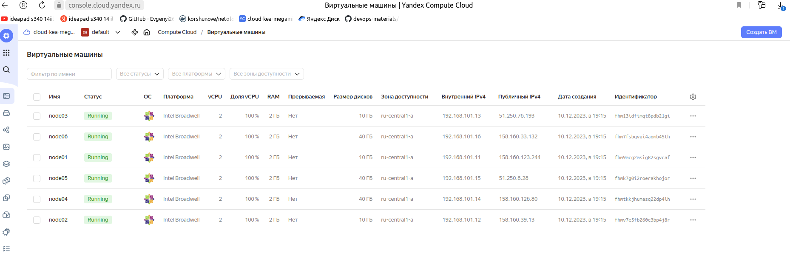
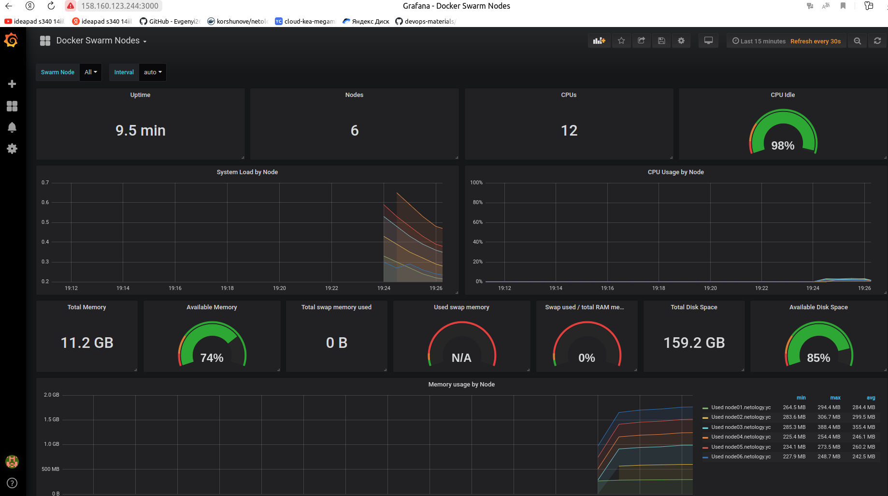
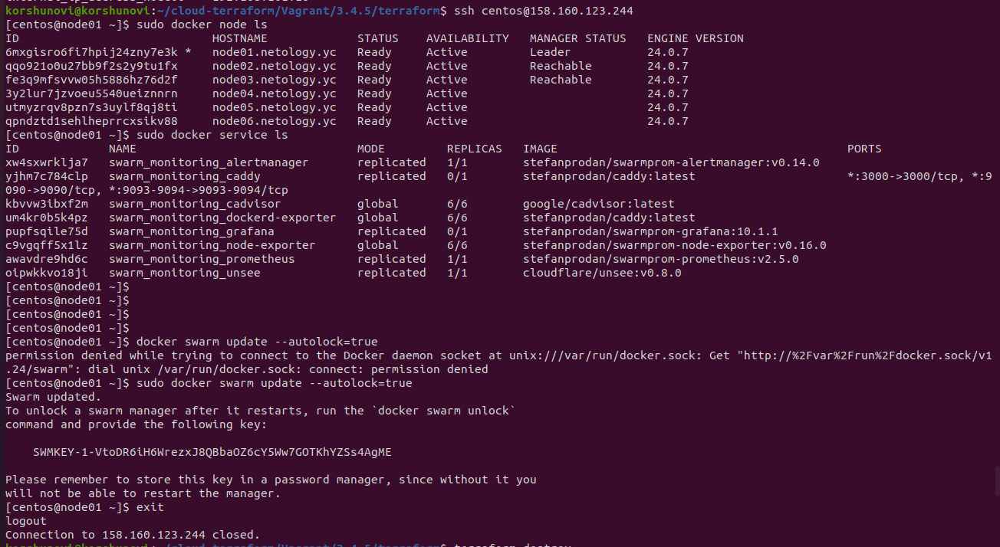

# Домашнее задание к занятию 5. «Оркестрация кластером Docker контейнеров на примере Docker Swarm»

## Задача 1

Дайте письменые ответы на вопросы:

В чём отличие режимов работы сервисов в Docker Swarm-кластере: replication и global?

- В  replication можно указать количество реплик для запуска на узлах. При выходе из строя какого-то узла Docker Swarm запускает реплику на свободном узле.
- В global количество реплик указать нельзя. Они запускаются на каждом узле в кластере и равно количеству доступных узлов.

Какой алгоритм выбора лидера используется в Docker Swarm-кластере?
 
- В Docker Swarm кластере используется алгоритм поддержания распределенного консенсуса — Raft. Выбор лидера происходит следующим образом: если ноды-фолловеры не слышат лидера, они переходят в статус кандидата, кандидат на лидера отправляет остальным нодам запрос на голосование и, большинством голосов, выбирается лидером.

Что такое Overlay Network?

- Overlay-сети используются в контексте кластеров (Docker Swarm), где виртуальная сеть, которую используют контейнеры, связывает несколько физических хостов, на которых запущен Docker. Другими словами: это виртуальная сеть Docker Swarm, для упрощенного взаимодействия между собой контейнеров.

## Задача 2

Создайте ваш первый Docker Swarm-кластер в Яндекс Облаке.

Чтобы получить зачёт, предоставьте скриншот из терминала (консоли) с выводом команды:
```
docker node ls
```


На ноду лидер подключиться не удалось, причину так и не понял. При аналогичных действиях получалось обратная ситуация, на ноду 01 с лидером подключался, на другую (например ноду02) выпадала та же ошибка.




## Задача 3

Создайте ваш первый, готовый к боевой эксплуатации кластер мониторинга, состоящий из стека микросервисов.

Чтобы получить зачёт, предоставьте скриншот из терминала (консоли), с выводом команды:
```
docker service ls
```
Скриншот с сервисами в предыдущем скриншоте.



## Задача 4 (*)

Выполните на лидере Docker Swarm-кластера команду, указанную ниже, и дайте письменное описание её функционала — что она делает и зачем нужна:
```
# см.документацию: https://docs.docker.com/engine/swarm/swarm_manager_locking/
docker swarm update --autolock=true
```

В этом случае не поднялись все сервисы, перезапуск сервера не помог всему запуститься.


Данной командой получаем ключ для разблокировки swarm, а делается он, чтобы защитить свои ключи шифрования.