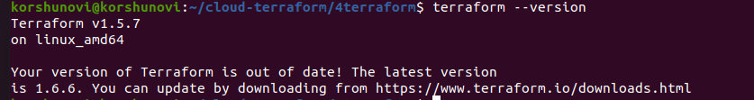
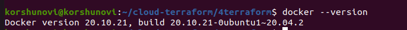
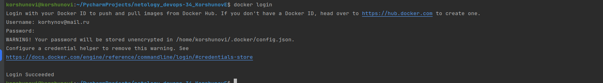
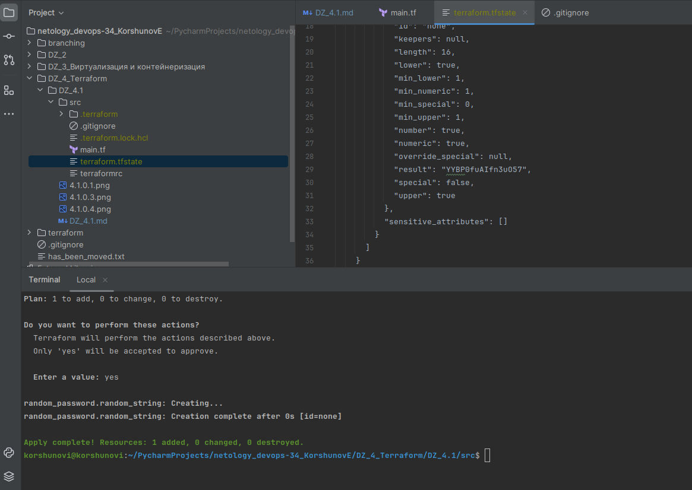
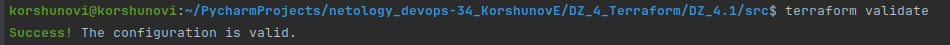
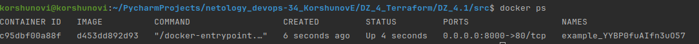
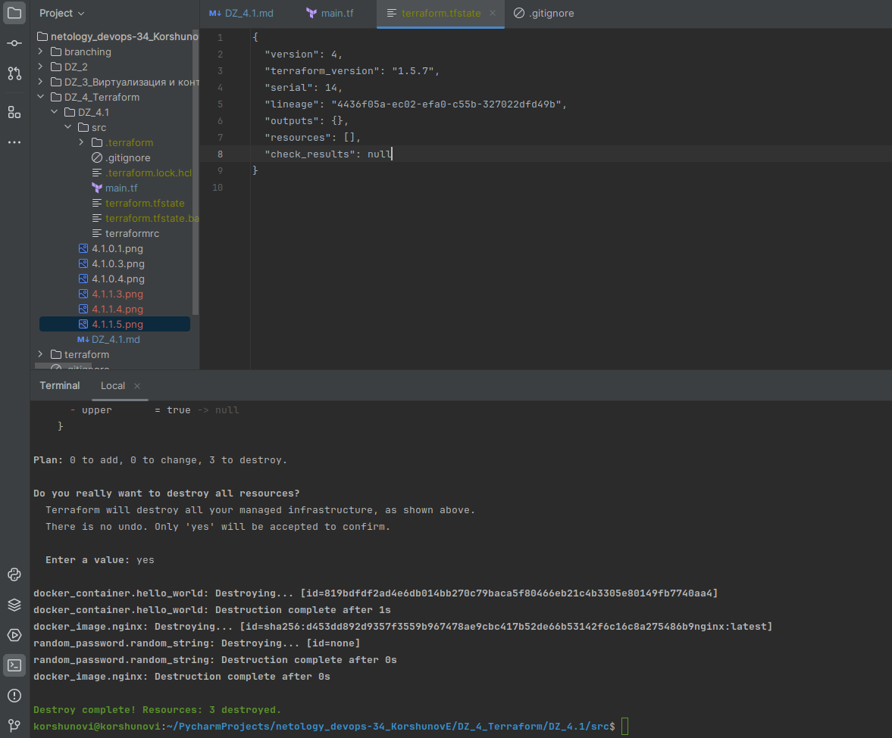
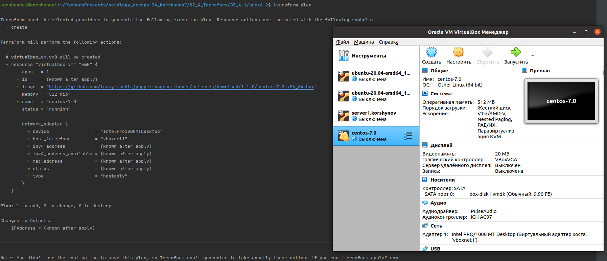

# Домашнее задание к занятию «Введение в Terraform»


### Чек-лист готовности к домашнему заданию

1. Скачайте и установите **Terraform** версии =1.5.Х (версия 1.6 может вызывать проблемы с Яндекс провайдером) . Приложите скриншот вывода команды ```terraform --version```.



2. Скачайте на свой ПК этот git-репозиторий. Исходный код для выполнения задания расположен в директории **01/src**.
3. Убедитесь, что в вашей ОС установлен docker.



4. Зарегистрируйте аккаунт на сайте https://hub.docker.com/, выполните команду docker login и введите логин, пароль.


------

### Внимание!! Обязательно предоставляем на проверку получившийся код в виде ссылки на ваш github-репозиторий!
------

### Задание 1

1. Перейдите в каталог [**src**](https://github.com/netology-code/ter-homeworks/tree/main/01/src). Скачайте все необходимые зависимости, использованные в проекте. 
2. Изучите файл **.gitignore**. В каком terraform-файле, согласно этому .gitignore, допустимо сохранить личную, секретную информацию?

- Личную, секретную информацию допустимо хранить в personal.auto.tfvars.

3. Выполните код проекта. Найдите  в state-файле секретное содержимое созданного ресурса **random_password**, пришлите в качестве ответа конкретный ключ и его значение.


"result": "YYBP0fuAIfn3uO57"

4. Раскомментируйте блок кода, примерно расположенный на строчках 29–42 файла **main.tf**.
Выполните команду ```terraform validate```. Объясните, в чём заключаются намеренно допущенные ошибки. Исправьте их.

- Получил 2 ошибки:

```console
-Error: Missing name for resource
│ 
│   on main.tf line 24, in resource "docker_image":
│   24: resource "docker_image" {
│ 
│ All resource blocks must have 2 labels (type, name).
╵
╷
│ Error: Invalid resource name
│ 
│   on main.tf line 29, in resource "docker_container" "1nginx":
│   29: resource "docker_container" "1nginx" {

```

- После корректировки имени, получил 3-ю ошибку:

```console
Error: Reference to undeclared resource
│ 
│   on main.tf line 31, in resource "docker_container" "nginx":
│   31:   name  = "example_${random_password.random_string_FAKE.resulT}"

```

- Итоговый вариант:

```console
esource "docker_image" "nginx" {
  name         = "nginx:latest"
  keep_locally = true
}

resource "docker_container" "nginx" {
  image = docker_image.nginx.image_id
  name  = "example_${random_password.random_string.result}"
```


5. Выполните код. В качестве ответа приложите: исправленный фрагмент кода и вывод команды ```docker ps```.



6. Замените имя docker-контейнера в блоке кода на ```hello_world```. Не перепутайте имя контейнера и имя образа. Мы всё ещё продолжаем использовать name = "nginx:latest". Выполните команду ```terraform apply -auto-approve```.
Объясните своими словами, в чём может быть опасность применения ключа  ```-auto-approve```. Догадайтесь или нагуглите зачем может пригодиться данный ключ? В качестве ответа дополнительно приложите вывод команды ```docker ps```.

- При изменении имени получил ошибку:
```console
Error: Unable to create container: Error response from daemon: Conflict. The container name "/example_YYBP0fuAIfn3uO57" is already in use by container "c95dbf00a88fe632b03aa1aa0e2204039df002a0f7a5d734c1c08ede48124abe". You have to remove (or rename) that container to be able to reuse that name.
│ 
│   with docker_container.hello_world,
│   on main.tf line 29, in resource "docker_container" "hello_world":
│   29: resource "docker_container" "hello_world" {
```
- Повторная отправка команды дала результат:

```console
korshunovi@korshunovi:~/PycharmProjects/netology_devops-34_KorshunovE/DZ_4_Terraform/DZ_4.1/src$ docker ps
CONTAINER ID   IMAGE     COMMAND   CREATED   STATUS    PORTS     NAMES
korshunovi@korshunovi:~/PycharmProjects/netology_devops-34_KorshunovE/DZ_4_Terraform/DZ_4.1/src$ terraform apply -auto-approve
docker_image.nginx: Refreshing state... [id=sha256:d453dd892d9357f3559b967478ae9cbc417b52de66b53142f6c16c8a275486b9nginx:latest]
random_password.random_string: Refreshing state... [id=none]

Terraform used the selected providers to generate the following execution plan. Resource actions are indicated with the following symbols:
  + create

.....
Plan: 1 to add, 0 to change, 0 to destroy.
docker_container.hello_world: Creating...
docker_container.hello_world: Creation complete after 2s [id=819bdfdf2ad4e6db014bb270c79baca5f80466eb21c4b3305e80149fb7740aa4]

Apply complete! Resources: 1 added, 0 changed, 0 destroyed.
korshunovi@korshunovi:~/PycharmProjects/netology_devops-34_KorshunovE/DZ_4_Terraform/DZ_4.1/src$ docker ps
CONTAINER ID   IMAGE          COMMAND                  CREATED         STATUS         PORTS                  NAMES
819bdfdf2ad4   d453dd892d93   "/docker-entrypoint.…"   6 seconds ago   Up 3 seconds   0.0.0.0:8000->80/tcp   example_YYBP0fuAIfn3uO57


```
Из описания команды -auto-approve следует, что будет перезатёрт процесс (изменена инфораструктура) без подтвердления, удалив существующий, получается автоматизация. И это может пригодиться  при выполнении процессов CI/CD: при развёртывании инфраструктцры и необходимости автоматического установки приложений, без подтверждения операции Terraform. 

7. Уничтожьте созданные ресурсы с помощью **terraform**. Убедитесь, что все ресурсы удалены. Приложите содержимое файла **terraform.tfstate**. 


8. Объясните, почему при этом не был удалён docker-образ **nginx:latest**. Ответ **обязательно** подкрепите строчкой из документации [**terraform провайдера docker**](https://docs.comcloud.xyz/providers/kreuzwerker/docker/latest/docs).  (ищите в классификаторе resource docker_image )

- В документации по ссылке информации не нашел. Но на просторах интернета пишут, что из-за значения в настройках keep_locally = true, docker-образ не был удалён.

The docs for the terraform resource docker_image show the reason terraform attempted to destroy the image upon terraform destroy: the template main.tf had keep-locally set to true.

------

## Дополнительное задание (со звёздочкой*)

**Настоятельно рекомендуем выполнять все задания со звёздочкой.** Они помогут глубже разобраться в материале.   
Задания со звёздочкой дополнительные, не обязательные к выполнению и никак не повлияют на получение вами зачёта по этому домашнему заданию. 

### Задание 2*

1. Изучите в документации provider [**Virtualbox**](https://docs.comcloud.xyz/providers/shekeriev/virtualbox/latest/docs) от 
shekeriev
2. Создайте с его помощью любую виртуальную машину. Чтобы не использовать VPN, советуем выбрать любой образ с расположением в GitHub из [**списка**](https://www.vagrantbox.es/).

В качестве ответа приложите plan для создаваемого ресурса. Примечание: создание самого ресурса может вызывать различные ошибки взаимодействия с virtualbox. Тк virtualbox в данном случае не является целью обучения - можете не создавать саму виртуальную машину.

.