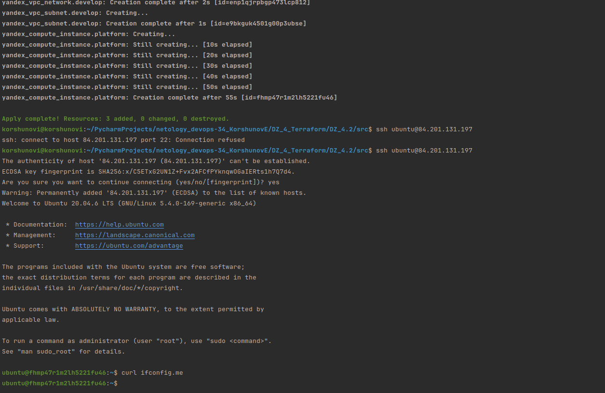
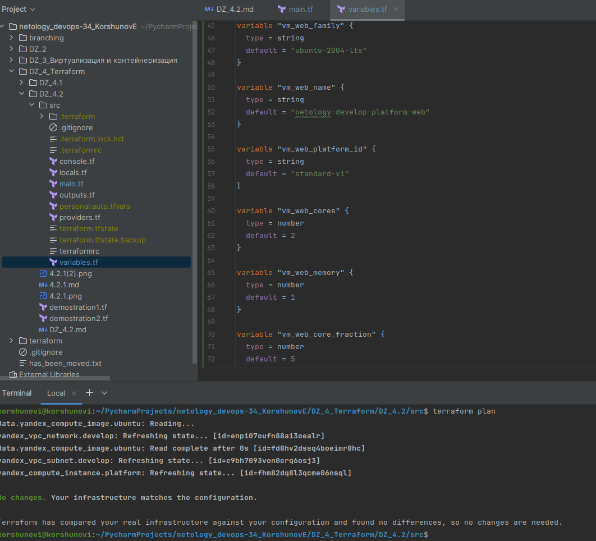
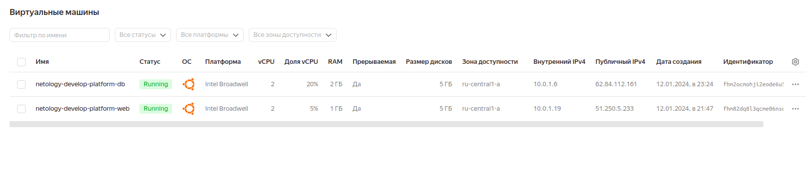
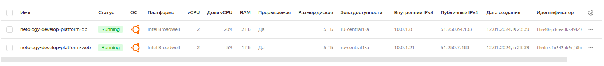
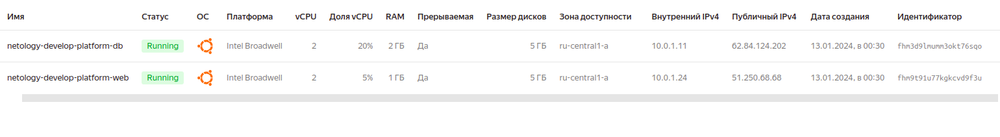
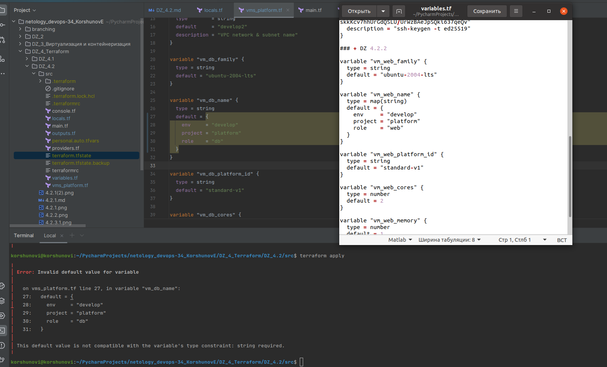
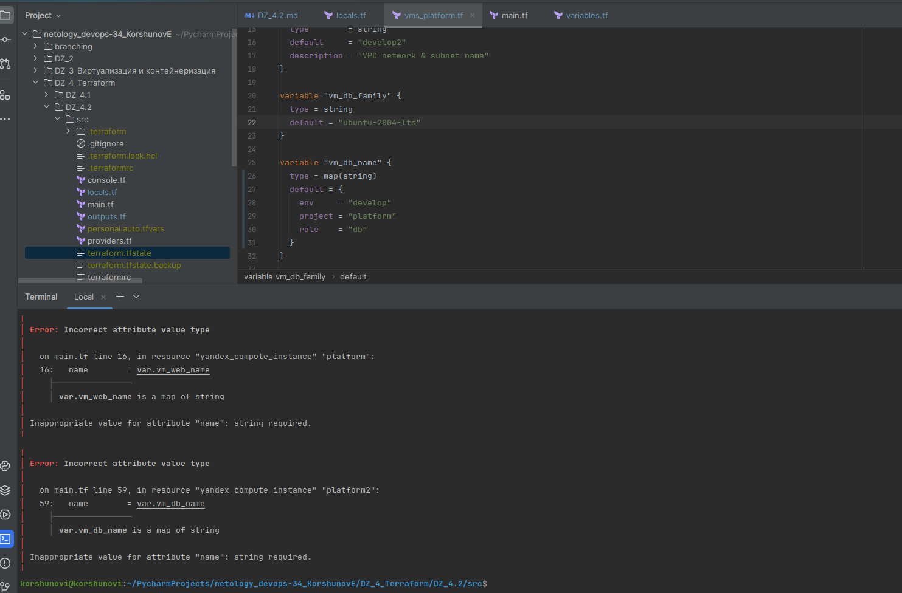
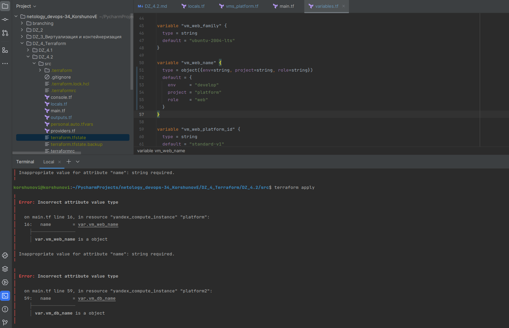

# Домашнее задание к занятию «Основы Terraform. Yandex Cloud»


### Задание 1
В качестве ответа всегда полностью прикладывайте ваш terraform-код в git.  Убедитесь что ваша версия **Terraform** =1.5.Х (версия 1.6.Х может вызывать проблемы с Яндекс провайдером) 

1. Изучите проект. В файле variables.tf объявлены переменные для Yandex provider.
2. Создайте сервисный аккаунт и ключ. [service_account_key_file](https://terraform-provider.yandexcloud.net).
3. Сгенерируйте новый или используйте свой текущий ssh-ключ. Запишите его открытую(public) часть в переменную **vms_ssh_public_root_key**.
4. Инициализируйте проект, выполните код. Исправьте намеренно допущенные синтаксические ошибки. Ищите внимательно, посимвольно. Ответьте, в чём заключается их суть.

Ошибки были в блоке:

```console
with yandex_compute_instance.platform,
│   on main.tf line 15, in resource "yandex_compute_instance" "platform":
│   15: resource "yandex_compute_instance" "platform" {
```

Исправил строку platform_id = "standard-v1", тк существует всего 3 вида standard и добавил ядро, чтобы получилось 2 (минимально допустимое).


5. Подключитесь к консоли ВМ через ssh и выполните команду ``` curl ifconfig.me```.
Примечание: К OS ubuntu "out of a box, те из коробки" необходимо подключаться под пользователем ubuntu: ```"ssh ubuntu@vm_ip_address"```. Предварительно убедитесь, что ваш ключ добавлен в ssh-агент: ```eval $(ssh-agent) && ssh-add``` Вы познакомитесь с тем как при создании ВМ создать своего пользователя в блоке metadata в следующей лекции.;



6. Ответьте, как в процессе обучения могут пригодиться параметры ```preemptible = true``` и ```core_fraction=5``` в параметрах ВМ.

Оба параметра отвечают за экономию ресурсов. 

```preemptible = true```  - для создания прерываемой ВМ, она может быть остановлена в любой момент времени.

```core_fraction=5``` - ограничивает работу CPU, число указано в процентах. Получается производительность ядер только 5 %.

### Задание 2

1. Замените все хардкод-**значения** для ресурсов **yandex_compute_image** и **yandex_compute_instance** на **отдельные** переменные. К названиям переменных ВМ добавьте в начало префикс **vm_web_** .  Пример: **vm_web_name**.

[main.tf](src%2Fmain.tf)

2. Объявите нужные переменные в файле variables.tf, обязательно указывайте тип переменной. Заполните их **default** прежними значениями из main.tf.

[variables.tf](src%2Fvariables.tf)

3. Проверьте terraform plan. Изменений быть не должно. 



### Задание 3

1. Создайте в корне проекта файл 'vms_platform.tf' . Перенесите в него все переменные первой ВМ.

[vms_platform.tf](src%2Fvms_platform.tf)

2. Скопируйте блок ресурса и создайте с его помощью вторую ВМ в файле main.tf: **"netology-develop-platform-db"** ,  ```cores  = 2, memory = 2, core_fraction = 20```. Объявите её переменные с префиксом **vm_db_** в том же файле ('vms_platform.tf').  ВМ должна работать в зоне "ru-central1-b"

[main.tf](src%2Fmain.tf)

3. Примените изменения.

Не получилось вторую машину завести  в зону "ru-central1-b", при terraform apply получаю ошибку, ниже. Сами конфигурации в файлах выше.

``` 
Error: Error while requesting API to create network: server-request-id = 997146ea-e9ea-4298-ac12-d7af16a74ddf server-trace-id = 433d65e1af39b782:92f5460bba4a22b0:433d65e1af39b782:1 client-request-id = f0ec308a-a0ec-4e92-9a93-f6c139aeb2ed client-trace-id = 701e9fa9-46ef-4f31-87b4-944a1452f2bb rpc error: code = AlreadyExists desc = Network with name develop already exists
│ 
│   with yandex_vpc_network.develop2,
│   on main.tf line 45, in resource "yandex_vpc_network" "develop2":
│   45: resource "yandex_vpc_network" "develop2" {
```



При дальнейших изменениях, ошибок больше не было, часть лога ниже. Оба сервера создались всё равно в одной зоне.

``` 
  + resources {
          + core_fraction = 20
          + cores         = 2
          + memory        = 2
        }

      + scheduling_policy {
          + preemptible = true
        }
    }

  # yandex_vpc_network.develop will be created
  + resource "yandex_vpc_network" "develop" {
      + created_at                = (known after apply)
      + default_security_group_id = (known after apply)
      + folder_id                 = (known after apply)
      + id                        = (known after apply)
      + labels                    = (known after apply)
      + name                      = "develop"
      + subnet_ids                = (known after apply)
    }

  # yandex_vpc_network.develop2 will be created
  + resource "yandex_vpc_network" "develop2" {
      + created_at                = (known after apply)
      + default_security_group_id = (known after apply)
      + folder_id                 = (known after apply)
      + id                        = (known after apply)
      + labels                    = (known after apply)
      + name                      = "develop2"
      + subnet_ids                = (known after apply)
    }

  # yandex_vpc_subnet.develop will be created
  + resource "yandex_vpc_subnet" "develop" {
      + created_at     = (known after apply)
      + folder_id      = (known after apply)
      + id             = (known after apply)
      + labels         = (known after apply)
      + name           = "develop"
      + network_id     = (known after apply)
      + v4_cidr_blocks = [
          + "10.0.1.0/24",
        ]
      + v6_cidr_blocks = (known after apply)
      + zone           = "ru-central1-a"
    }

  # yandex_vpc_subnet.develop2 will be created
  + resource "yandex_vpc_subnet" "develop2" {
      + created_at     = (known after apply)
      + folder_id      = (known after apply)
      + id             = (known after apply)
      + labels         = (known after apply)
      + name           = "develop2"
      + network_id     = (known after apply)
      + v4_cidr_blocks = [
          + "10.0.1.0/24",
        ]
      + v6_cidr_blocks = (known after apply)
      + zone           = "ru-central1-b"
    }

Plan: 6 to add, 0 to change, 0 to destroy.

Do you want to perform these actions?
  Terraform will perform the actions described above.
  Only 'yes' will be accepted to approve.

  Enter a value: yes

yandex_vpc_network.develop: Creating...
yandex_vpc_network.develop2: Creating...
yandex_vpc_network.develop: Creation complete after 3s [id=enp7jcs0uhht034bbleg]
yandex_vpc_subnet.develop: Creating...
yandex_vpc_subnet.develop: Creation complete after 0s [id=e9bj12di5jmnbnjfsicn]
yandex_compute_instance.platform2: Creating...
yandex_compute_instance.platform: Creating...
yandex_vpc_network.develop2: Creation complete after 4s [id=enpu6hragpg3qfl4ssdi]
yandex_vpc_subnet.develop2: Creating...
yandex_vpc_subnet.develop2: Creation complete after 1s [id=e2l5f306o273g574t7q2]
yandex_compute_instance.platform2: Still creating... [10s elapsed]
yandex_compute_instance.platform: Still creating... [10s elapsed]
yandex_compute_instance.platform2: Still creating... [20s elapsed]
yandex_compute_instance.platform: Still creating... [20s elapsed]
yandex_compute_instance.platform2: Still creating... [30s elapsed]
yandex_compute_instance.platform: Still creating... [30s elapsed]
yandex_compute_instance.platform2: Creation complete after 40s [id=fhm40mp3deadks49k48s]
yandex_compute_instance.platform: Still creating... [40s elapsed]
yandex_compute_instance.platform: Creation complete after 41s [id=fhmbrsfo343nk0rj0bcs]

Apply complete! Resources: 6 added, 0 changed, 0 destroyed.
``` 



### Задание 4

1. Объявите в файле outputs.tf **один** output , содержащий: instance_name, external_ip, fqdn для каждой из ВМ в удобном лично для вас формате.
2. Примените изменения.

[outputs.tf](src%2Foutputs.tf)

В качестве решения приложите вывод значений ip-адресов команды ```terraform output```.

``` 
korshunovi@korshunovi:~/PycharmProjects/netology_devops-34_KorshunovE/DZ_4_Terraform/DZ_4.2/src$ terraform output
instance_name = "netology-develop-platform-web"
instance_name2 = "netology-develop-platform-db"
ip_address_platform = "51.250.68.68"
ip_address_platform2 = "62.84.124.202"
Внутренний_FQDN2 = "fhm3d9lmumm3okt76sqo.auto.internal"
Идентификатор_FQDN = "fhm9t91u77kgkcvd9f3u.auto.internal"
``` 



### Задание 5

1. В файле locals.tf опишите в **одном** local-блоке имя каждой ВМ, используйте интерполяцию ${..} с НЕСКОЛЬКИМИ переменными по примеру из лекции.

[locals.tf](src%2Flocals.tf)

2. Замените переменные внутри ресурса ВМ на созданные вами local-переменные.
3. Примените изменения.

Задание так и не получилось выполнить. При замене переменных в файлах [variables.tf](src%2Fvariables.tf) и [vms_platform.tf](src%2Fvms_platform.tf) всё время получал различные ошибки связанные с типом переменных.
Изначальный вариант, при указании разных типов переменных, в файле variables ошибок не было, а на файл vms_platform выдал ошибку:



При замене типа везде на map(string), выдал уже другую ошибку:



Пробовал различные варианты значений типов переменных в строке "type", везде ошибка на main.tf:

``` 
Error: Incorrect attribute value type
│ 
│   on main.tf line 16, in resource "yandex_compute_instance" "platform":
│   16:   name        = var.vm_web_name
│     ├────────────────
│     │ var.vm_web_name is a map of string
│ 
│ Inappropriate value for attribute "name": string required.
``` 




### Доработка 5 задания выполнена в файле ЗДАСЬ: [4.2.5.md](4.2.5.md)

### Задание 6

1. Вместо использования трёх переменных  ".._cores",".._memory",".._core_fraction" в блоке  resources {...}, объедините их в единую map-переменную **vms_resources** и  внутри неё конфиги обеих ВМ в виде вложенного map.  
  
```
   пример из terraform.tfvars:
   vms_resources = {
     web={
       cores=
       memory=
       core_fraction=
       ...
     },
     db= {
       cores=
       memory=
       core_fraction=
       ...
     }
   }
   ```
2. Создайте и используйте отдельную map переменную для блока metadata, она должна быть общая для всех ваших ВМ.
   ```
   пример из terraform.tfvars:
   metadata = {
     serial-port-enable = 1
     ssh-keys           = "ubuntu:ssh-ed25519 AAAAC..."
   }
   ```  

3. Найдите и закоментируйте все, более не используемые переменные проекта.

[main.tf](src%2Fmain.tf)
 
[variables.tf](src%2Fvariables.tf)

[vms_platform.tf](src%2Fvms_platform.tf)

4. Проверьте terraform plan. Изменений быть не должно.


------

## Дополнительное задание (со звёздочкой*)

**Настоятельно рекомендуем выполнять все задания со звёздочкой.**   
Они помогут глубже разобраться в материале. Задания со звёздочкой дополнительные, не обязательные к выполнению и никак не повлияют на получение вами зачёта по этому домашнему заданию. 


------
### Задание 7*

Изучите содержимое файла console.tf. Откройте terraform console, выполните следующие задания: 

1. Напишите, какой командой можно отобразить **второй** элемент списка test_list.
2. Найдите длину списка test_list с помощью функции length(<имя переменной>).
3. Напишите, какой командой можно отобразить значение ключа admin из map test_map.
4. Напишите interpolation-выражение, результатом которого будет: "John is admin for production server based on OS ubuntu-20-04 with X vcpu, Y ram and Z virtual disks", используйте данные из переменных test_list, test_map, servers и функцию length() для подстановки значений.

**Примечание**: если не догадаетесь как вычленить слово "admin", погуглите: "terraform get keys of map"

В качестве решения предоставьте необходимые команды и их вывод.

------

### Задание 8*
1. Напишите и проверьте переменную test и полное описание ее type в соответствии со значением из terraform.tfvars:
```
test = [
  {
    "dev1" = [
      c,
      "10.0.1.7",
    ]
  },
  {
    "dev2" = [
      "ssh -o 'StrictHostKeyChecking=no' ubuntu@84.252.140.88",
      "10.0.2.29",
    ]
  },
  {
    "prod1" = [
      "ssh -o 'StrictHostKeyChecking=no' ubuntu@51.250.2.101",
      "10.0.1.30",
    ]
  },
]
```
2. Напишите выражение в terraform console, которое позволит вычленить строку "ssh -o 'StrictHostKeyChecking=no' ubuntu@62.84.124.117"
------

------

### Задание 9*

Используя инструкцию https://cloud.yandex.ru/ru/docs/vpc/operations/create-nat-gateway#tf_1, настройте для ваших ВМ nat_gateway. Для проверки уберите внешний IP адрес (nat=false) у ваших ВМ и проверьте доступ в интернет с ВМ, подключившись к ней через serial console. Для подключения предварительно через ssh измените пароль пользователя: ```sudo passwd ubuntu```

### Правила приёма работыДля подключения предварительно через ssh измените пароль пользователя: sudo passwd ubuntu
В качестве результата прикрепите ссылку на MD файл с описанием выполненой работы в вашем репозитории. Так же в репозитории должен присутсвовать ваш финальный код проекта.

**Важно. Удалите все созданные ресурсы**.

