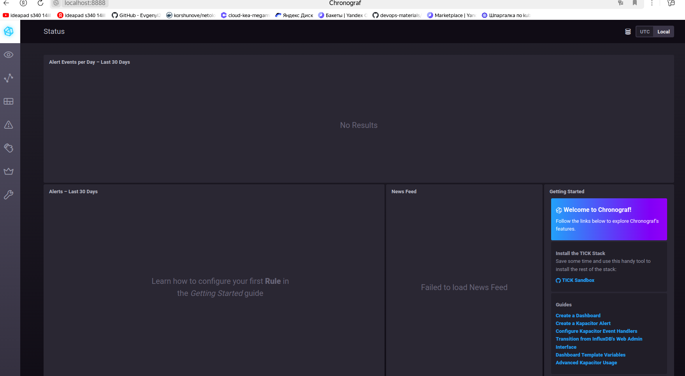
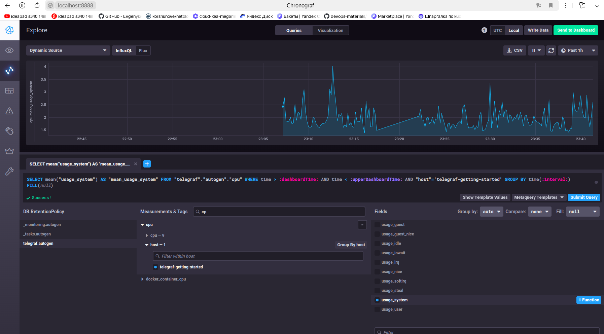
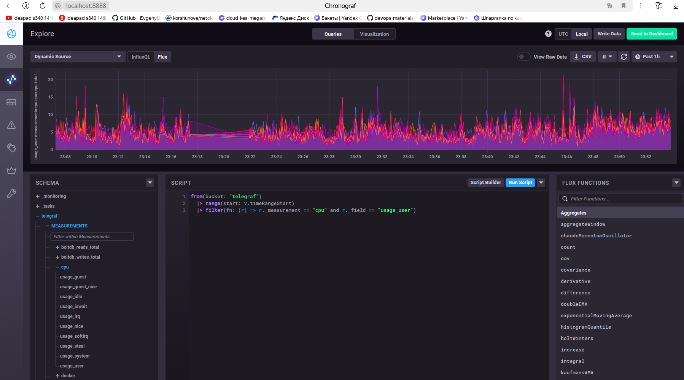

# Домашнее задание к занятию "13.Системы мониторинга"

## Обязательные задания

1. Вас пригласили настроить мониторинг на проект. На онбординге вам рассказали, что проект представляет из себя 
платформу для вычислений с выдачей текстовых отчетов, которые сохраняются на диск. Взаимодействие с платформой 
осуществляется по протоколу http. Также вам отметили, что вычисления загружают ЦПУ. Какой минимальный набор метрик вы
выведите в мониторинг и почему?

LAN - отображение скорости/количества трафика/состояние работы сетевых интерфейсов. Таким образом закрываем все вопросы связанные с сетью.

Уровень ошибок через коды ответов от web-сервера. Сможем оперативно получить информацию о проблемах в работе проекта.

Время отклика при выполнении запросов. Это поможет отследить зависание, остановку или другие причины в работе проекта.

CPU - мониторинг нагрузки процессов, для быстрого принятия решений при их перегрузки.

RAM - мониторинг памяти, чтобы не улететь в 100% и через время остановить работу системы.

HDD - Мониторинг свободного места на дисках, чтобы не забить все ресурсы, после чего система может остановиться.

inodes -  это структуры данных в системах Unix, используемые для хранения информации о файлах и каталогах. Если они переполнятся, то новые файлы не будут созданы.

#
2. Менеджер продукта посмотрев на ваши метрики сказал, что ему непонятно что такое RAM/inodes/CPUla. Также он сказал, 
что хочет понимать, насколько мы выполняем свои обязанности перед клиентами и какое качество обслуживания. Что вы 
можете ему предложить?

Поясню менеджеру что такое RAM/inodes/CPUla для чего они нужны и на что могут повлиять. По выполнению и качеству обслуживания предложу использовать целевые показатели с конкретными цифрами по каждому показателю:

SLO. Целевой уровень качества обслуживания. Целевое значение или диапазон значений.
SLA. Соглашение об уровне обслуживания. Явный или неявный контракт с внешними пользователями, включающий в себя последствия невыполнения SLO.
SLI. Индикатор качества обслуживания. Конкретная величина предоставляемого обслуживания.

#
3. Вашей DevOps команде в этом году не выделили финансирование на построение системы сбора логов. Разработчики в свою 
очередь хотят видеть все ошибки, которые выдают их приложения. Какое решение вы можете предпринять в этой ситуации, 
чтобы разработчики получали ошибки приложения?

- использовать системные логи с самих приложений, посредством написания скриптов на python или bash,
- развернуть стек Vector + Clickhouse + Lighthouse, 
- развернуть стек Elasticsearch + Logstash + Kibana.

#
4. Вы, как опытный SRE, сделали мониторинг, куда вывели отображения выполнения SLA=99% по http кодам ответов. 
Вычисляете этот параметр по следующей формуле: summ_2xx_requests/summ_all_requests. Данный параметр не поднимается выше 
70%, но при этом в вашей системе нет кодов ответа 5xx и 4xx. Где у вас ошибка?

Пропущены ошибки 1хх/3хх/6хх, итоговая формула: (summ_2xx_requests + summ_2xx_requests + summ_3xx_requests + summ_6xx_requests)/summ_all_requests

#
5. Опишите основные плюсы и минусы pull и push систем мониторинга.

#### Плюсы push-модели:

- упращение репликации данных в разные системы мониторинга или их резервные копии
- более гибкая настройка отправки пакетов данных с метриками
- udp - это менее затратный способ передачи данных, из-за чего может возрасти производительность сбора метрик

#### Минусы push-модели:

большое количество настройки и подключений агентов на один сервер.

#### Плюсы pull-модели:

- легче контролировать подлинность данных
- можно настроить единый proxy server до всех агентов с TLS
- упрощённая отладка получения данных с агентов

#### Минусы pull-модели: 

- при недоступности/поломки сервера, перестают собиратьсся метрики и мониторинг перестаёт работать.

#
6. Какие из ниже перечисленных систем относятся к push модели, а какие к pull? А может есть гибридные?

    - Prometheus 
    - TICK
    - Zabbix
    - VictoriaMetrics
    - Nagios

push: TICK

pull: Prometheus, Nagios

push/pull: Zabbix, VictoriaMetrics

#
7. Склонируйте себе [репозиторий](https://github.com/influxdata/sandbox/tree/master) и запустите TICK-стэк, 
используя технологии docker и docker-compose.

В виде решения на это упражнение приведите скриншот веб-интерфейса ПО chronograf (`http://localhost:8888`). 

P.S.: если при запуске некоторые контейнеры будут падать с ошибкой - проставьте им режим `Z`, например
`./data:/var/lib:Z`

[sandbox](sandbox)

[docker-compose.yml](sandbox/docker-compose.yml)



#
8. Перейдите в веб-интерфейс Chronograf (http://localhost:8888) и откройте вкладку Data explorer.
        
    - Нажмите на кнопку Add a query
    - Изучите вывод интерфейса и выберите БД telegraf.autogen
    - В `measurments` выберите cpu->host->telegraf-getting-started, а в `fields` выберите usage_system. Внизу появится график утилизации cpu.
    - Вверху вы можете увидеть запрос, аналогичный SQL-синтаксису. Поэкспериментируйте с запросом, попробуйте изменить группировку и интервал наблюдений.

Для выполнения задания приведите скриншот с отображением метрик утилизации cpu из веб-интерфейса.



#
9. Изучите список [telegraf inputs](https://github.com/influxdata/telegraf/tree/master/plugins/inputs). 
Добавьте в конфигурацию telegraf следующий плагин - [docker](https://github.com/influxdata/telegraf/tree/master/plugins/inputs/docker):
```
[[inputs.docker]]
  endpoint = "unix:///var/run/docker.sock"
```

Дополнительно вам может потребоваться донастройка контейнера telegraf в `docker-compose.yml` дополнительного volume и 
режима privileged:
```
  telegraf:
    image: telegraf:1.4.0
    privileged: true
    volumes:
      - ./etc/telegraf.conf:/etc/telegraf/telegraf.conf:Z
      - /var/run/docker.sock:/var/run/docker.sock:Z
    links:
      - influxdb
    ports:
      - "8092:8092/udp"
      - "8094:8094"
      - "8125:8125/udp"
```

После настройке перезапустите telegraf, обновите веб интерфейс и приведите скриншотом список `measurments` в 
веб-интерфейсе базы telegraf.autogen . Там должны появиться метрики, связанные с docker.

Факультативно можете изучить какие метрики собирает telegraf после выполнения данного задания.

