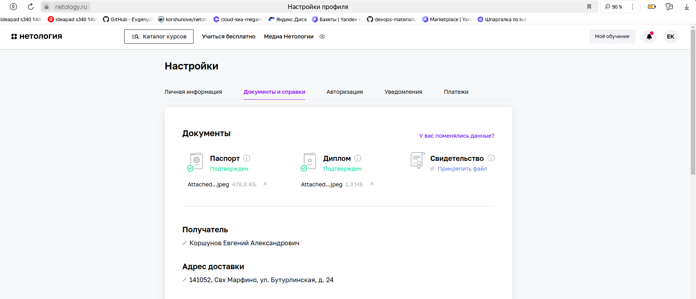

Задание
Вопросы по заданию
Преподаватель: Асия Яблочкова, Асия Яблочкова, Асия Яблочкова, Максим Зайкин
Для получения доступа к дипломной работе и курсу «Антология трудоустройства» от Центра развития карьеры Нетологии ответьте, пожалуйста, на несколько вопросов.

1. Получилось ли у вас загрузить в личный кабинет документы, подтверждающие личность, и диплом о высшем или среднем специальном образовании?

а) Да
Пришлите ссылку на скриншот личного кабинета.

б) Нет, но сделаю это в ближайшее время. Инструкция по загрузке документов в личный кабинет.
в) Не загрузил диплом, у меня его нет

2. Нужна ли вам справка об обучении после сдачи дипломной работы? Справка выдаётся всем студентам, в том числе тем, у кого нет диплома о высшем или среднем специальном образовании.
а) Да
После получения зачёта по дипломной работе напишите в чат поддержки.

3. Выполнен ли вами необходимый минимум заданий на каждом модуле профессии для допуска к дипломной работе?
а) Да
Поздравляем! Сообщим вам позже, кто будет вашим дипломным руководителем.

Благодарим вас за ответы!