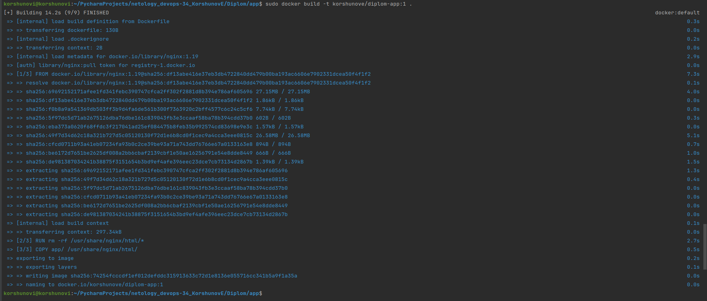

# Дипломный практикум в Yandex.Cloud

  * [Цели:](#цели)
  * [Этапы выполнения:](#этапы-выполнения)
     * [Создание облачной инфраструктуры](#создание-облачной-инфраструктуры)
     * [Создание Kubernetes кластера](#создание-kubernetes-кластера)
     * [Создание тестового приложения](#создание-тестового-приложения)
     * [Подготовка cистемы мониторинга и деплой приложения](#подготовка-cистемы-мониторинга-и-деплой-приложения)
     * [Установка и настройка CI/CD](#установка-и-настройка-cicd)
  * [Что необходимо для сдачи задания?](#что-необходимо-для-сдачи-задания)
  * [Как правильно задавать вопросы дипломному руководителю?](#как-правильно-задавать-вопросы-дипломному-руководителю)

**Перед началом работы над дипломным заданием изучите [Инструкция по экономии облачных ресурсов](https://github.com/netology-code/devops-materials/blob/master/cloudwork.MD).**

---
## Цели:

1. Подготовить облачную инфраструктуру на базе облачного провайдера Яндекс.Облако.
2. Запустить и сконфигурировать Kubernetes кластер.
3. Установить и настроить систему мониторинга.
4. Настроить и автоматизировать сборку тестового приложения с использованием Docker-контейнеров.
5. Настроить CI для автоматической сборки и тестирования.
6. Настроить CD для автоматического развёртывания приложения.

---
## Этапы выполнения:

### Создание облачной инфраструктуры

Для начала необходимо подготовить облачную инфраструктуру в ЯО при помощи [Terraform](https://www.terraform.io/).

Особенности выполнения:

- Бюджет купона ограничен, что следует иметь в виду при проектировании инфраструктуры и использовании ресурсов;
Для облачного k8s используйте региональный мастер(неотказоустойчивый). Для self-hosted k8s минимизируйте ресурсы ВМ и долю ЦПУ. В обоих вариантах используйте прерываемые ВМ для worker nodes.

Предварительная подготовка к установке и запуску Kubernetes кластера.

1. Создайте сервисный аккаунт, который будет в дальнейшем использоваться Terraform для работы с инфраструктурой с необходимыми и достаточными правами. Не стоит использовать права суперпользователя

Ответ:
[bucket.tf](src-s3/bucket.tf)

2. Подготовьте [backend](https://www.terraform.io/docs/language/settings/backends/index.html) для Terraform:  
   а. Рекомендуемый вариант: S3 bucket в созданном ЯО аккаунте(создание бакета через TF)
   б. Альтернативный вариант:  [Terraform Cloud](https://app.terraform.io/)

Ответ:
[backend.tf](src/backend.tf)

3. Создайте конфигурацию Terrafrom, используя созданный бакет ранее как бекенд для хранения стейт файла. Конфигурации Terraform для создания сервисного аккаунта и бакета и основной инфраструктуры следует сохранить в разных папках.

Ответ:
[bucket.tf](src-s3/bucket.tf)   
[variables.tf](src-s3/variables.tf)

4. Создайте VPC с подсетями в разных зонах доступности.

Ответ:
[main.tf](src/main.tf)

5. Убедитесь, что теперь вы можете выполнить команды `terraform destroy` и `terraform apply` без дополнительных ручных действий.

Ответ:
[vm.tf](src/vm.tf)  
[variables.tf](src/variables.tf)    
[src](src)

6. В случае использования [Terraform Cloud](https://app.terraform.io/) в качестве [backend](https://www.terraform.io/docs/language/settings/backends/index.html) убедитесь, что применение изменений успешно проходит, используя web-интерфейс Terraform cloud.

Ожидаемые результаты:

1. Terraform сконфигурирован и создание инфраструктуры посредством Terraform возможно без дополнительных ручных действий, стейт основной конфигурации сохраняется в бакете или Terraform Cloud
2. Полученная конфигурация инфраструктуры является предварительной, поэтому в ходе дальнейшего выполнения задания возможны изменения.

---
### Создание Kubernetes кластера

На этом этапе необходимо создать [Kubernetes](https://kubernetes.io/ru/docs/concepts/overview/what-is-kubernetes/) кластер на базе предварительно созданной инфраструктуры.   Требуется обеспечить доступ к ресурсам из Интернета.

Это можно сделать двумя способами:

1. Рекомендуемый вариант: самостоятельная установка Kubernetes кластера.  
   а. При помощи Terraform подготовить как минимум 3 виртуальных машины Compute Cloud для создания Kubernetes-кластера. Тип виртуальной машины следует выбрать самостоятельно с учётом требовании к производительности и стоимости. Если в дальнейшем поймете, что необходимо сменить тип инстанса, используйте Terraform для внесения изменений.  
   б. Подготовить [ansible](https://www.ansible.com/) конфигурации, можно воспользоваться, например [Kubespray](https://kubernetes.io/docs/setup/production-environment/tools/kubespray/)  
   в. Задеплоить Kubernetes на подготовленные ранее инстансы, в случае нехватки каких-либо ресурсов вы всегда можете создать их при помощи Terraform.
2. Альтернативный вариант: воспользуйтесь сервисом [Yandex Managed Service for Kubernetes](https://cloud.yandex.ru/services/managed-kubernetes)  
  а. С помощью terraform resource для [kubernetes](https://registry.terraform.io/providers/yandex-cloud/yandex/latest/docs/resources/kubernetes_cluster) создать **региональный** мастер kubernetes с размещением нод в разных 3 подсетях      
  б. С помощью terraform resource для [kubernetes node group](https://registry.terraform.io/providers/yandex-cloud/yandex/latest/docs/resources/kubernetes_node_group)
  
Ожидаемый результат:

1. Работоспособный Kubernetes кластер.
2. В файле `~/.kube/config` находятся данные для доступа к кластеру.
3. Команда `kubectl get pods --all-namespaces` отрабатывает без ошибок.

Ответ:
Кластер создавал методом kubeadm

После поднятия кластера, конфиг файл перенёс к себе на локальную машину и дальнейшую работу продолжил с неё.

---
### Создание тестового приложения

Для перехода к следующему этапу необходимо подготовить тестовое приложение, эмулирующее основное приложение разрабатываемое вашей компанией.

Способ подготовки:

1. Рекомендуемый вариант:  
   а. Создайте отдельный git репозиторий с простым nginx конфигом, который будет отдавать статические данные.  

Ответ: 
https://github.com/Evgenyi26rus/app/tree/master

   б. Подготовьте Dockerfile для создания образа приложения.

Ответ: https://github.com/Evgenyi26rus/app/blob/master/Dockerfile

2. Альтернативный вариант:  
   а. Используйте любой другой код, главное, чтобы был самостоятельно создан Dockerfile.

Ожидаемый результат:

1. Git репозиторий с тестовым приложением и Dockerfile.

Ответ:
https://github.com/Evgenyi26rus/app/tree/master/app

2. Регистри с собранным docker image. В качестве регистри может быть DockerHub или [Yandex Container Registry](https://cloud.yandex.ru/services/container-registry), созданный также с помощью terraform.

Ответ:
https://hub.docker.com/layers/korshunove/diplom-app/1/images/sha256-b069e10a45dc6697bb65f915c8c287b2b12d28de893fd2a9a68718bde63864d5?context=repo

---
### Подготовка cистемы мониторинга и деплой приложения

Уже должны быть готовы конфигурации для автоматического создания облачной инфраструктуры и поднятия Kubernetes кластера.  
Теперь необходимо подготовить конфигурационные файлы для настройки нашего Kubernetes кластера.

Цель:
1. Задеплоить в кластер [prometheus](https://prometheus.io/), [grafana](https://grafana.com/), [alertmanager](https://github.com/prometheus/alertmanager), [экспортер](https://github.com/prometheus/node_exporter) основных метрик Kubernetes.

Ответ:
Мониторинг разворачивал с помощью "kube-prometheus". Графана доступна по ссылке: http://130.193.37.168:32000, подключение стандартное (admin/admin)
На скриншотах видно, что при диплое приложения, данные сразу начали отображаться на дашбордах:

[svc_grafana.yaml](monitoring/svc_grafana.yaml)

~~~
korshunovi@korshunovi:~/PycharmProjects/netology_devops-34_KorshunovE$ kubectl get all -n monitoring
NAME                                      READY   STATUS    RESTARTS        AGE
pod/alertmanager-main-0                   2/2     Running   0               7h16m
pod/alertmanager-main-1                   2/2     Running   0               7h16m
pod/alertmanager-main-2                   2/2     Running   0               7h16m
pod/blackbox-exporter-7f7bbb987d-96bcd    3/3     Running   0               15h
pod/grafana-564bd845f6-ng948              1/1     Running   0               15h
pod/kube-state-metrics-66589bb466-gn78d   3/3     Running   0               15h
pod/node-exporter-6rbsq                   2/2     Running   2 (7h16m ago)   17h
pod/node-exporter-7hcz9                   2/2     Running   2 (7h16m ago)   17h
pod/node-exporter-pk44v                   2/2     Running   0               17h
pod/prometheus-adapter-77f8587965-dwxlx   1/1     Running   0               15h
pod/prometheus-adapter-77f8587965-kzlnt   1/1     Running   0               15h
pod/prometheus-k8s-0                      2/2     Running   0               7h16m
pod/prometheus-k8s-1                      2/2     Running   0               7h16m
pod/prometheus-operator-d9b65cf6f-vd74r   2/2     Running   0               15h

NAME                            TYPE        CLUSTER-IP       EXTERNAL-IP   PORT(S)                      AGE
service/alertmanager-main       ClusterIP   10.105.187.78    <none>        9093/TCP,8080/TCP            17h
service/alertmanager-operated   ClusterIP   None             <none>        9093/TCP,9094/TCP,9094/UDP   17h
service/blackbox-exporter       ClusterIP   10.99.148.113    <none>        9115/TCP,19115/TCP           17h
service/grafana                 ClusterIP   10.100.169.188   <none>        3000/TCP                     17h
service/kube-state-metrics      ClusterIP   None             <none>        8443/TCP,9443/TCP            17h
service/node-exporter           ClusterIP   None             <none>        9100/TCP                     17h
service/prometheus-adapter      ClusterIP   10.102.131.64    <none>        443/TCP                      17h
service/prometheus-k8s          ClusterIP   10.96.56.42      <none>        9090/TCP,8080/TCP            17h
service/prometheus-operated     ClusterIP   None             <none>        9090/TCP                     17h
service/prometheus-operator     ClusterIP   None             <none>        8443/TCP                     17h
service/svc-grafana             NodePort    10.97.254.3      <none>        3000:32000/TCP               17h

NAME                           DESIRED   CURRENT   READY   UP-TO-DATE   AVAILABLE   NODE SELECTOR            AGE
daemonset.apps/node-exporter   3         3         3       3            3           kubernetes.io/os=linux   17h

NAME                                  READY   UP-TO-DATE   AVAILABLE   AGE
deployment.apps/blackbox-exporter     1/1     1            1           17h
deployment.apps/grafana               1/1     1            1           17h
deployment.apps/kube-state-metrics    1/1     1            1           17h
deployment.apps/prometheus-adapter    2/2     2            2           17h
deployment.apps/prometheus-operator   1/1     1            1           17h

NAME                                            DESIRED   CURRENT   READY   AGE
replicaset.apps/blackbox-exporter-7f7bbb987d    1         1         1       17h
replicaset.apps/grafana-564bd845f6              1         1         1       17h
replicaset.apps/kube-state-metrics-66589bb466   1         1         1       17h
replicaset.apps/prometheus-adapter-77f8587965   2         2         2       17h
replicaset.apps/prometheus-operator-d9b65cf6f   1         1         1       17h

NAME                                 READY   AGE
statefulset.apps/alertmanager-main   3/3     17h
statefulset.apps/prometheus-k8s      2/2     17h

~~~

2. Задеплоить тестовое приложение, например, [nginx](https://www.nginx.com/) сервер отдающий статическую страницу.

Ответ: Тестовое приложение доступно по ссылке: http://130.193.37.168:32002/ Разворачивалось с помощью деплоя и сервиса с типом NodePort: 

https://github.com/Evgenyi26rus/app
~~~
korshunovi@korshunovi:~/PycharmProjects/netology_devops-34_KorshunovE$ kubectl get all -n app
NAME                       READY   STATUS        RESTARTS   AGE
pod/app-5f4b44b54f-6zkn9   1/1     Running       0          176m
pod/app-5f4b44b54f-9kr77   1/1     Running       0          176m
pod/app-77979d7f6d-bzp8c   1/1     Terminating   0          15h
pod/app-77979d7f6d-ggzvn   1/1     Terminating   0          15h

NAME                  TYPE       CLUSTER-IP     EXTERNAL-IP   PORT(S)        AGE
service/service-app   NodePort   10.96.106.38   <none>        80:32002/TCP   17h

NAME                  READY   UP-TO-DATE   AVAILABLE   AGE
deployment.apps/app   2/2     2            2           17h

NAME                             DESIRED   CURRENT   READY   AGE
replicaset.apps/app-5f4b44b54f   2         2         2       176m
replicaset.apps/app-77979d7f6d   0         0         0       17h

~~~

Способ выполнения:
1. Воспользоваться пакетом [kube-prometheus](https://github.com/prometheus-operator/kube-prometheus), который уже включает в себя [Kubernetes оператор](https://operatorhub.io/) для [grafana](https://grafana.com/), [prometheus](https://prometheus.io/), [alertmanager](https://github.com/prometheus/alertmanager) и [node_exporter](https://github.com/prometheus/node_exporter). Альтернативный вариант - использовать набор helm чартов от [bitnami](https://github.com/bitnami/charts/tree/main/bitnami).

2. Если на первом этапе вы не воспользовались [Terraform Cloud](https://app.terraform.io/), то задеплойте и настройте в кластере [atlantis](https://www.runatlantis.io/) для отслеживания изменений инфраструктуры. Альтернативный вариант 3 задания: вместо Terraform Cloud или atlantis настройте на автоматический запуск и применение конфигурации terraform из вашего git-репозитория в выбранной вами CI-CD системе при любом комите в main ветку. Предоставьте скриншоты работы пайплайна из CI/CD системы.

Ожидаемый результат:
1. Git репозиторий с конфигурационными файлами для настройки Kubernetes.
2. Http доступ на 80 порту к web интерфейсу grafana.
3. Дашборды в grafana отображающие состояние Kubernetes кластера.
4. Http доступ на 80 порту к тестовому приложению.
---
### Установка и настройка CI/CD

Осталось настроить ci/cd систему для автоматической сборки docker image и деплоя приложения при изменении кода.

Цель:

1. Автоматическая сборка docker образа при коммите в репозиторий с тестовым приложением.
2. Автоматический деплой нового docker образа.

Можно использовать [teamcity](https://www.jetbrains.com/ru-ru/teamcity/), [jenkins](https://www.jenkins.io/), [GitLab CI](https://about.gitlab.com/stages-devops-lifecycle/continuous-integration/) или GitHub Actions.

Ожидаемый результат:

1. Интерфейс ci/cd сервиса доступен по http.

Ответ: ci/cd настраивался через https://github.com/Evgenyi26rus/app/actions

2. При любом коммите в репозиторие с тестовым приложением происходит сборка и отправка в регистр Docker образа.

Ответ: https://hub.docker.com/layers/korshunove/diplom-app/master/images/sha256-c86d555dc959153b0e65bbeb7b7f785f6ae97409832e630b1df160706ceaddab?context=repo

workflows: https://github.com/Evgenyi26rus/app/blob/master/.github/workflows/production_deployment.yml

3. При создании тега (например, v1.0.0) происходит сборка и отправка с соответствующим label в регистри, а также деплой соответствующего Docker образа в кластер Kubernetes.

---
## Что необходимо для сдачи задания?

1. Репозиторий с конфигурационными файлами Terraform и готовность продемонстрировать создание всех ресурсов с нуля.

[src-s3](src-s3)

[src](src)

2. Пример pull request с комментариями созданными atlantis'ом или снимки экрана из Terraform Cloud или вашего CI-CD-terraform pipeline.

https://github.com/Evgenyi26rus/app/actions

3. Репозиторий с конфигурацией ansible, если был выбран способ создания Kubernetes кластера при помощи ansible.
4. Репозиторий с Dockerfile тестового приложения и ссылка на собранный docker image.

https://hub.docker.com/layers/korshunove/diplom-app/master/images/sha256-c86d555dc959153b0e65bbeb7b7f785f6ae97409832e630b1df160706ceaddab?context=repo

https://github.com/Evgenyi26rus/app/blob/master/Dockerfile

5. Репозиторий с конфигурацией Kubernetes кластера.

[config](config)

6. Ссылка на тестовое приложение и веб интерфейс Grafana с данными доступа.

Grafana: http://130.193.37.168:32000   admin/admin

Приложение: http://130.193.37.168:32002/

7. Все репозитории рекомендуется хранить на одном ресурсе (github, gitlab)
