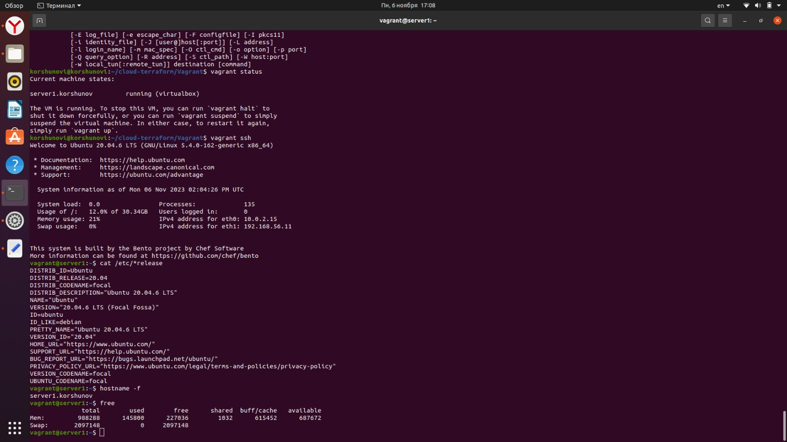
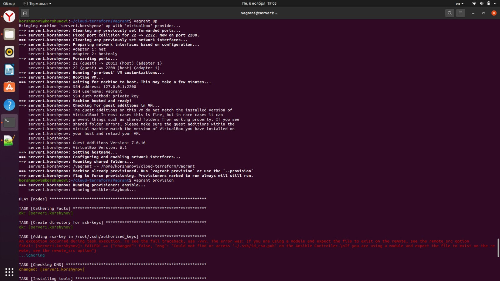

## Задача 1

- Опишите основные преимущества применения на практике IaaC-паттернов.
Скорость развёртывания сред; избавление от ручной настройки каждой среды, переведя всё в автоматический режим настроив среду единоразово; легко масштабируются среды; скорость изменения/контроля/восстановления всех развёрнутых сред при необходимости.

- Какой из принципов IaaC является основополагающим?
Избавление от ручной настройки каждой среды, посредством замены её на настройку шаблона с паттерном и дальнейшему масштабированию сред.

## Задача 2

- Чем Ansible выгодно отличается от других систем управление конфигурациями?
Отсутствием потребности в установки агентов на целевые хосты, простое подключнеие через ssh.

- Какой, на ваш взгляд, метод работы систем конфигурации более надёжный — push или pull?
push - так как изменения можно внести сразу во все среды по факту потребности, так же в этом случае не требуются ресурсы на сервер (как в режиме pull).

## Задача 3

Установите на личный linux-компьютер(или учебную ВМ с linux):

- [VirtualBox](https://www.virtualbox.org/),
- [Vagrant](https://github.com/netology-code/devops-materials), рекомендуем версию 2.3.4(старшие версии могут возникать проблемы интеграции с ansible)
- [Terraform](https://github.com/netology-code/devops-materials/blob/master/README.md)  версии 1.5.Х (1.6.х может вызывать проблемы с яндекс-облаком),
- Ansible.

korshunovi@korshunovi:~$ virtualbox --help | head -n 1 | awk '{print $NF}'
v6.1.38_Ubuntu
------------------------

korshunovi@korshunovi:~$ vagrant --version
Vagrant 2.3.4

------------------------

korshunovi@korshunovi:~$ terraform --version
Terraform v1.5.7
on linux_amd64

Your version of Terraform is out of date! The latest version
is 1.6.3. You can update by downloading from https://www.terraform.io/downloads.html

------------------------

korshunovi@korshunovi:~/.local/pipx/venvs/ansible/bin$ ansible --version
ansible 2.9.6
  config file = /etc/ansible/ansible.cfg
  configured module search path = ['/home/korshunovi/.ansible/plugins/modules', '/usr/share/ansible/plugins/modules']
  ansible python module location = /usr/lib/python3/dist-packages/ansible
  executable location = /usr/bin/ansible
  python version = 3.8.10 (default, May 26 2023, 14:05:08) [GCC 9.4.0]

## Задача 4 

Воспроизведите практическую часть лекции самостоятельно.

- Создайте виртуальную машину.
- Зайдите внутрь ВМ, убедитесь, что Docker установлен с помощью команды

